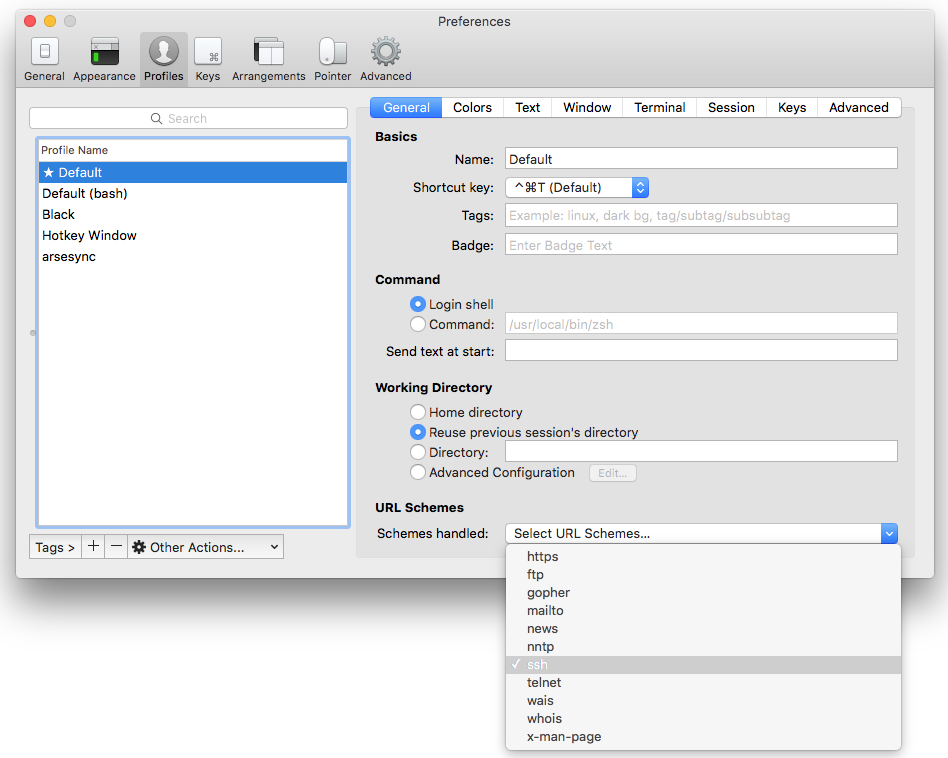

# Secure SHell for Alfred

Open SSH/SFTP/mosh connections from [Alfred 3][alfredapp] with autosuggestions based on SSH config files, `/etc/hosts` and your history.

<!-- MarkdownTOC autolink="true" bracket="round" levels="1,2,3,4" autoanchor="true" -->

- [Features](#features)
- [Installation](#installation)
- [Usage](#usage)
- [Configuration](#configuration)
    - [Sources](#sources)
    - [Advanced Configuration](#advanced-configuration)
        - [URLs](#urls)
        - [Commands](#commands)
        - [Using iTerm2](#using-iterm2)
    - [License & Thanks](#license-and-thanks)
    - [Changelog](#changelog)

<!-- /MarkdownTOC -->

## <a id="features">Features</a>

- Auto-suggest hostnames
- Remembers usernames, so you don't have to type them in every time
- Alternate actions:
    - Open connection with **mosh**
    - Open **SFTP** connection
    - **Ping** host
- Sources (can be managed individually):
    - `~/.ssh/config`
    - `~/.ssh/known_hosts`
    - History (i.e. username + host addresses previously entered by the user)
    - `/etc/hosts`
    - `/etc/ssh/ssh_config`

## <a id="installation">Installation</a>

Download [the latest release][gh-releases] and double-click the file to install in Alfred.

## <a id="usage">Usage</a>

The main keyword is `ssh`:

- `ssh [<query>]` — View and filter known SSH connections.

    - `↩` or `⌘+<NUM>` — Open the connection.
    - `⇥` — Expand the query to selected connection's title. Useful for adding a port number.
    - `⌘+↩` — Open an SFTP connection instead.
    - `⌥+↩` — Open a mosh connection instead.
    - `⇧+↩` — Ping host.
    - `^+↩` — Forget connection (if it's from history).

`sshconf` manages the configuration:

- `sshconf [<query>]`
- Edit workflow settings (see <a id="configuration">Configuration</a>
- `An Update is Available!` or `Workflow is Up to Date` — Action to check for an update and install if one is available.
- `Source: XYZ` — Toggle source on/off
- `Log File` — Open workflow's log file in the default app (usually Console.app)
- `Documentation` / `Report Issue` / `Visit Forum` — Open this file, the workflow's issue tracker or forum thread in your browser.

## <a id="configuration">Configuration</a>

Sources can be configured from within the workflow using the `sshconf` keyword. Other settings are manageable by the [workflow's configuration sheet][confsheet].

### <a id="sources">Sources</a>

The following sources are available and can be toggled on/off using `sshconf`:

|         Name        |         Source         |
|---------------------|------------------------|
| SSH Config          | `~/.ssh/config`        |
| SSH Config (system) | `/etc/ssh/ssh_config`  |
| /etc/hosts          | `/etc/hosts`           |
| History             | User-entered hostnames |
| Known Hosts         | `~/.ssh/known_hosts`   |

### <a id="advanced-configuration">Advanced Configuration</a>

There are several additional settings that can only be edited via the [workflow's configuration sheet][confsheet], which allow you to specify a few commands and applications.

To understand these, it's necessary to understand a bit about how the workflow works.

The workflow opens connections either via a URL (`sftp://...` and `ssh://...` by default) or via a shell command (`ping` and `mosh` by default). URLs are passed off to the system, which opens them in the default application. Shell commands are handled by Alfred's [Terminal Command Action][termcmd], which effectively creates a new tab in your default terminal and pastes the command in there.

#### <a id="urls">URLs</a>

If you'd like `sftp://...` or `ssh://...` URLs to be passed to a specific application, specify its *name* for `SFTP_APP` or `SSH_APP` respectively, e.g. `Transmit` or `ForkLift` for SFTP, or `Terminal` for SSH.

#### <a id="commands">Commands</a>

The shell command is configurable through Alfred's preferences (see [Using iTerm2](/#using-iterm2) for more information).

There are two commands you can configure in the workflow, `MOSH_CMD` and `SSH_CMD`.

`MOSH_CMD` sets the command that is pasted in your terminal when it's run. Normally, the default of `mosh` should be sufficient, but set to a full path if the command can't be found.

Set `MOSH_CMD` to empty to disable mosh.

`SSH_CMD` allows you to override the default behaviour of generating and opening an `ssh://...` URL. If `SSH_CMD` is non-empty, a shell command is generated and run in your terminal instead. `SSH_CMD` is the name or path of the `ssh` command.

Compared to the default `ssh://...` URL method, this has the advantage of running the command in your own shell, so your local configuration files should be loaded before the SSH connection is made. It has the downside of being slower and less well-tested than the default URL method.

#### <a id="using-iterm2">Using iTerm2</a>

If you'd prefer to use iTerm2 rather than Terminal.app, there are two steps:

1. To have shell commands open in iTerm2, install [@stuartcryan][stuart]'s [iTerm2 plugin for Alfred][iterm-plugin].
2. To open `ssh://...` URLs in iTerm2, Set iTerm2 as the default handler for `ssh:` URLs in iTerm2's own preferences under `Profiles > PROFILE_NAME > General > URL Schemes`:

### <a id="licensing--thanks">Licensing & Thanks</a>

This workflow uses an [MIT Licence][mit]. It also uses the following libraries (all [MIT Licence][mit]):

- [ssh_config][ssh_config] to parse SSH config files.
- [AwGo][awgo] for the workflowy stuff.

Icons from or based on the following fonts (all [SIL Licence][sil]):

- [Material Design Community][material]
- [FontAwesome][fontawesome]

This workflow started as a port of [@isometry's][isometry] Python [SSH workflow][ssh-breathe] to Go as a testbed for [AwGo][awgo]. It has since gained some additional features.

If you need Alfred 2 support, check out [@isometry's workflow][ssh-breathe].

### <a id="changelog">Changelog</a>

- **v0.8.0 — 2018-03-17**
    - Add option to use `ssh` command instead of URL.
        Enables loading of local shell configuration before opening connection. #8
    - Add in-workflow configuration of sources
    - Add links to docs, issue tracker and forum thread

- **v0.7.1 — 2016-12-12**
    - Fix updater bug
    - Smarter SSH URLs for hosts from `~/.ssh/config`
    - Better removal of duplicates
- **v0.6.0 — 2016-11-09**
    - Add in-workflow updates
- **v0.5.0 — 2016-10-31**
    - Add support for SSH configuration files (`~/.ssh/config` and `/etc/ssh/ssh_config`)
    - Alternate action: open connection with `mosh`
- **v0.4.0 — 2016-05-27**
    - Add ability to turn sources of suggestions off #1
- **v0.3.0 — 2016-05-26**
    - Alternate action: Open SFTP connection
    - Alternate action: Ping host
    - Remember connections with usernames, so you don't have to type the username each time
- **v0.2.0 — 2016-05-23**
    - First public release

[alfredapp]: https://www.alfredapp.com/
[awgo]: https://godoc.org/github.com/deanishe/awgo
[confsheet]: https://www.alfredapp.com/help/workflows/advanced/variables/#environment
[fontawesome]: https://fontawesome.com
[gh-releases]: https://github.com/deanishe/alfred-ssh/releases/latest
[isometry]: https://github.com/isometry
[iterm-plugin]: https://github.com/stuartcryan/custom-iterm-applescripts-for-alfred/
[material]: https://materialdesignicons.com/
[mit]: https://opensource.org/licenses/MIT
[sil]: http://scripts.sil.org/OFL
[ssh-breathe]: https://github.com/isometry/alfredworkflows/tree/master/net.isometry.alfred.ssh
[ssh_config]: https://github.com/havoc-io/ssh_config
[stuart]: https://github.com/stuartcryan/
[termcmd]: https://www.alfredapp.com/help/workflows/actions/terminal-command/
